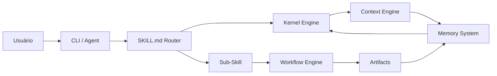

# 🏗️ Arquitetura — Delegado OS

> *"O Delegado não é um agent. É um sistema operacional para agents."*

---

## Visão Geral

```
┌─────────────────────────────────────────────────────────────────────┐
│                        DELEGADO OS                                   │
├─────────────────────────────────────────────────────────────────────┤
│                                                                       │
│  ┌──────────────┐  ┌──────────────┐  ┌──────────────┐               │
│  │ CLI          │  │ KERNEL       │  │ MEMORY       │               │
│  │ Interface    │  │ + Personality │  │ Persistent   │               │
│  │ (Bash)       │  │ Dark Analyst │  │ + Learned    │               │
│  └──────┬───────┘  └──────┬───────┘  └──────┬───────┘               │
│         │                 │                 │                        │
│         └─────────────────┼─────────────────┘                        │
│                           ↓                                          │
│  ┌─────────────────────────────────────────────────────┐             │
│  │              CONTEXT ENGINE                          │             │
│  │  - XML Metadata (briefing.xml)                      │             │
│  │  - Markdown Templates (templates/)                   │             │
│  │  - Workflow Orchestration (workflows/)              │             │
│  └─────────────────────────────────────────────────────┘             │
│                           ↓                                          │
│  ┌─────────────────────────────────────────────────────┐             │
│  │              SKILLS ENGINE                           │             │
│  │  - DOS (Delegado OS — command tree)                  │             │
│  │    ├── BMAD (4-phase workflow)                       │             │
│  │    ├── HELL (GRASP/GoF + TDD + Milestones)          │             │
│  │    ├── OpenSpec (spec-driven workflow)               │             │
│  │    └── GSD (atomic execution)                       │             │
│  └─────────────────────────────────────────────────────┘             │
│                           ↓                                          │
│  ┌─────────────────────────────────────────────────────┐             │
│  │              SUBAGENTS                               │             │
│  │  - ORCHESTRATOR (phase coordination)                │             │
│  └─────────────────────────────────────────────────────┘             │
│                                                                       │
└─────────────────────────────────────────────────────────────────────┘
```

---

## Componentes

### 1. CLI Interface (`delegado.sh`)

Interface de linha de comando em Bash. Ponto de entrada para interação direta via terminal.

| Comando | Função |
|---------|--------|
| `delegado.sh menu` | Menu interativo |
| `delegado.sh setup` | Setup inicial |
| `delegado.sh detectar` | Detectar stack |
| `delegado.sh aprender` | Ensinar regra |
| `delegado.sh memoria` | Ver memória |
| `delegado.sh status` | Status do sistema |
| `delegado.sh feedback` | Dar feedback |

### 2. Kernel Engine (`kernel/`)

O cérebro do sistema. Contém:

| Arquivo | Responsabilidade |
|---------|-----------------|
| `SISTEMA.md` | Arquitetura técnica, protocolos, workflows internos |
| `DELEGADO.md` | Personalidade "Dark Analyst", tom de voz, manifesto |
| `MEMORIA.md` | Sistema de memória multicamada |
| `adaptive-engine.md` | Motor adaptativo baseado em feedback |
| `convention-extractor.md` | Extrator de convenções do projeto |
| `onboarding.md` | Protocolo de onboarding |
| `user-preferences.md` | Preferências do usuário |
| `hell/` | HELL Method engine (core + workflow + example + Obsidian schema) |

### 3. Skills Engine (`skills/`)

Skills são módulos com `SKILL.md` que definem capacidades do agent:

```
skills/
├── delegado/           # Skills do Delegado
└── dos/                # Delegado OS skills
    ├── SKILL.md        ← Router principal /dos-*
    ├── hell/           ← 💀 HELL Method (9 sub-skills)
    ├── bmad/           ← BMAD 4-phase
    ├── propose/        ← Change proposals
    ├── specs/          ← Specifications
    ├── design/         ← Technical design
    ├── tasks/          ← Atomic tasks
    ├── apply/          ← Task execution
    ├── verify/         ← Verification
    ├── context/        ← Context loading
    ├── memory/         ← Memory access
    ├── learn/          ← Learning
    ├── feedback/       ← Feedback
    └── help/           ← Help display
```

### 4. Memory System (`memory/`)

Memória persistente multicamada:

| Camada | Tipo | Freshness | Onde |
|--------|------|-----------|------|
| Episódica | Sessão atual | Volátil | Contexto do agent |
| Semântica | Info do projeto | Permanente | `memory/` |
| Procedural | Regras aprendidas | Evolutivo | `memory/` |
| Fonte | Arquivos .md | Acumulativo | `memory/` |

### 5. Workflow Engine (`workflows/`)

| Workflow | Arquivo | Tipo |
|----------|---------|------|
| Especificação (OpenSpec) | `especificacao.yml` | Spec-driven |
| BMAD | `bmad.yml` | 4-phase |
| Fase (GSD) | `fase.yml` | Atomic execution |
| HELL Milestone | `hell-milestone.yml` | Checkpoint-driven |

### 6. Context Engine (`contexto/`)

Gera e consome contexto estruturado em XML:

```xml
<delegado_context version="1.0">
  <metadata>...</metadata>
  <project>...</project>
  <user>...</user>
  <task>...</task>
  <session>...</session>
</delegado_context>
```

---

## Fluxo de Dados



---

## Princípios Arquiteturais

1. **Skills como Módulos** — Cada skill é autocontido com seu `SKILL.md`
2. **Workflows como Pipelines** — Fases sequenciais com gates
3. **Memória como Estado** — Persistência entre sessões
4. **Contexto como Poder** — XML/Markdown structure para decisões informadas
5. **Extensibilidade** — Novos skills e workflows sem modificar o kernel
