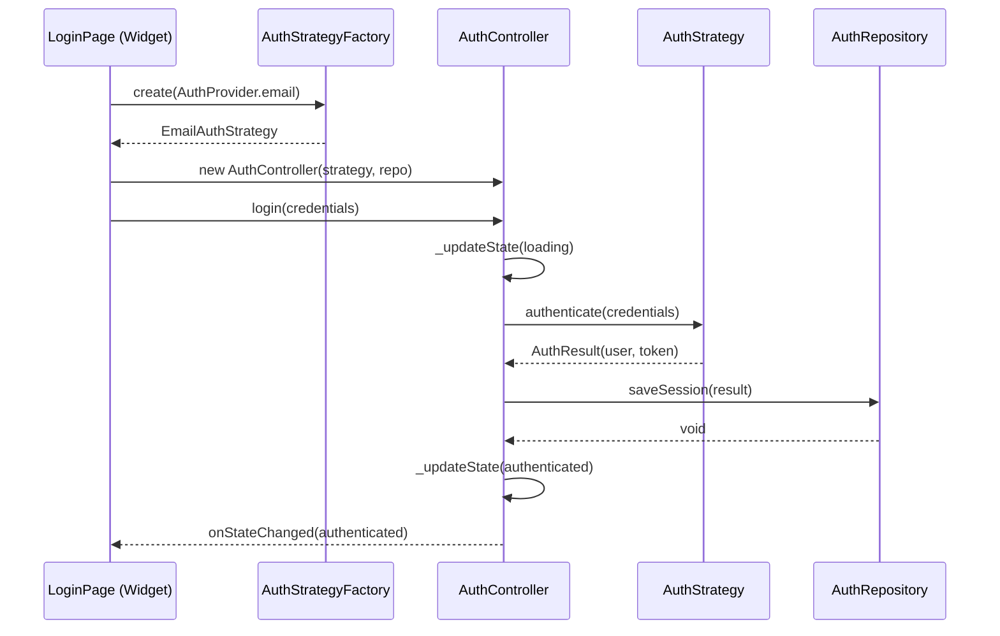
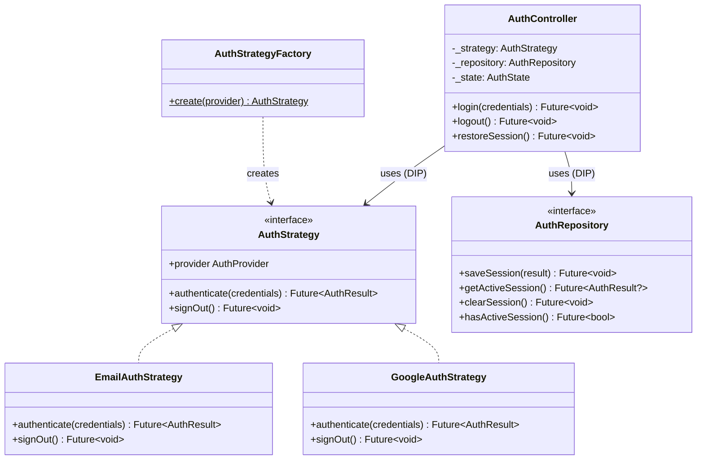

# 💀 HELL PRACTICAL EXAMPLE — Flutter + GRASP + TDD
# Demonstração: Sistema de Autenticação com Controller Pattern

> **Cenário:** App Flutter com login por email/senha e login social (Google).
> **Padrões demonstrados:** GRASP Controller, Strategy, Repository, Factory
> **Método:** TDD Red/Green/Refactor completo

---

```yaml
Project: [[HELL-Flutter-Auth-Example]]
HELL_Phase: Dev/TDD
Status: 🔥 ACTIVE
Patterns_Used: [Controller, Strategy, Repository, Factory]
Stack: Flutter 3.x, Dart, flutter_test
```

---

## 1. HELL SPECIFICATION (Fase 1 — Resumo)

### Requisitos Extraídos

| ID    | Caso de Uso                  | Ator    | Prioridade |
|-------|------------------------------|---------|------------|
| RF-01 | Login com email/senha        | Usuário | MUST       |
| RF-02 | Login com Google             | Usuário | MUST       |
| RF-03 | Logout                       | Usuário | MUST       |
| RF-04 | Persistir sessão             | Sistema | SHOULD     |

### GRASP Analysis

| Padrão               | Decisão                                              |
|-----------------------|------------------------------------------------------|
| **Information Expert** | `User` entity detém dados de autenticação             |
| **Controller**        | `AuthController` orquestra use cases de autenticação   |
| **Protected Variations** | `AuthStrategy` protege contra mudança de providers  |
| **Pure Fabrication**  | `AuthRepository` abstrai acesso a dados de auth        |
| **Creator**           | `AuthStrategyFactory` cria strategies concretas        |

### Pontos de Variação

| Ponto                    | Abstração           | Interface              |
|--------------------------|---------------------|------------------------|
| Provider de autenticação | Strategy Pattern    | `AuthStrategy`         |
| Storage de sessão        | Repository Pattern  | `AuthRepository`       |
| Criação de strategies    | Factory Pattern     | `AuthStrategyFactory`  |

---

## 2. HELL TDD CYCLE (Fase 2 — Completo)

### Estrutura de Diretórios

```
lib/
├── domain/
│   ├── entities/
│   │   └── user.dart
│   ├── repositories/
│   │   └── auth_repository.dart          # Interface
│   └── strategies/
│       └── auth_strategy.dart            # Interface
├── application/
│   ├── controllers/
│   │   └── auth_controller.dart          # GRASP Controller
│   └── factories/
│       └── auth_strategy_factory.dart    # GoF Factory
├── infrastructure/
│   ├── repositories/
│   │   └── auth_repository_impl.dart     # Implementação
│   └── strategies/
│       ├── email_auth_strategy.dart       # Strategy concreta
│       └── google_auth_strategy.dart      # Strategy concreta
test/
├── domain/
│   └── entities/
│       └── user_test.dart
├── application/
│   └── controllers/
│       └── auth_controller_test.dart
└── infrastructure/
    └── strategies/
        ├── email_auth_strategy_test.dart
        └── google_auth_strategy_test.dart
```

---

### DOMAIN LAYER — Entidades e Interfaces

#### `lib/domain/entities/user.dart`

```dart
/// Domain Entity: User
/// GRASP: Information Expert — User detém seus próprios dados de identidade.
class User {
  final String id;
  final String email;
  final String displayName;
  final AuthProvider provider;

  const User({
    required this.id,
    required this.email,
    required this.displayName,
    required this.provider,
  });

  /// Expert: User sabe se é autenticado via social
  bool get isSocialLogin =>
      provider == AuthProvider.google || provider == AuthProvider.apple;

  @override
  bool operator ==(Object other) =>
      identical(this, other) ||
      other is User && runtimeType == other.runtimeType && id == other.id;

  @override
  int get hashCode => id.hashCode;
}

enum AuthProvider { email, google, apple }
```

#### `lib/domain/strategies/auth_strategy.dart`

```dart
/// GRASP: Protected Variations
/// GoF: Strategy Pattern — Interface estável contra mudança de auth providers.
///
/// Cada provider concreto (email, Google, Apple) implementa esta interface.
/// O Controller NUNCA sabe qual provider está sendo usado.
abstract class AuthStrategy {
  /// Autentica o usuário e retorna o resultado.
  /// Lança [AuthException] em caso de falha.
  Future<AuthResult> authenticate(AuthCredentials credentials);

  /// Encerra a sessão do provider.
  Future<void> signOut();

  /// Identifica qual provider esta strategy representa.
  AuthProvider get provider;
}

/// Value Object: Credenciais de autenticação.
class AuthCredentials {
  final String? email;
  final String? password;
  final String? token;

  const AuthCredentials({this.email, this.password, this.token});

  /// Factory para credenciais de email/senha.
  const AuthCredentials.email({
    required String email,
    required String password,
  })  : email = email,
        password = password,
        token = null;

  /// Factory para credenciais de token (OAuth).
  const AuthCredentials.token({required String token})
      : email = null,
        password = null,
        token = token;
}

/// Value Object: Resultado de autenticação.
class AuthResult {
  final User user;
  final String sessionToken;

  const AuthResult({required this.user, required this.sessionToken});
}

/// Exception de domínio para falhas de autenticação.
class AuthException implements Exception {
  final String message;
  final String code;

  const AuthException({required this.message, required this.code});

  @override
  String toString() => 'AuthException($code): $message';
}
```

#### `lib/domain/repositories/auth_repository.dart`

```dart
/// GRASP: Pure Fabrication
/// Abstração artificial para persistência de sessão.
/// NÃO existe no domínio real, existe para manter coesão.
abstract class AuthRepository {
  /// Persiste a sessão do usuário autenticado.
  Future<void> saveSession(AuthResult result);

  /// Recupera a sessão salva (retorna null se expirada/inexistente).
  Future<AuthResult?> getActiveSession();

  /// Remove a sessão salva.
  Future<void> clearSession();

  /// Verifica se existe sessão ativa.
  Future<bool> hasActiveSession();
}
```

---

### APPLICATION LAYER — Controller (GRASP)

#### `lib/application/controllers/auth_controller.dart`

```dart
/// GRASP: Controller
/// 
/// RESPONSABILIDADE ÚNICA: Orquestrar o fluxo de autenticação.
/// 
/// NÃO contém lógica de negócio → delega para Strategy e Repository.
/// NÃO contém lógica de UI → apenas expõe estado reativo.
/// NÃO sabe qual provider está sendo usado → Protected Variations via Strategy.
///
/// Dependências: Todas via interface (DIP).
class AuthController {
  final AuthStrategy _strategy;
  final AuthRepository _repository;

  AuthState _state = const AuthState.unauthenticated();
  AuthState get state => _state;

  /// Hook para listeners de estado (UI observa).
  void Function(AuthState)? onStateChanged;

  AuthController({
    required AuthStrategy strategy,
    required AuthRepository repository,
  })  : _strategy = strategy,
        _repository = repository;

  /// Use Case: Login
  /// Delega autenticação para Strategy e persiste sessão no Repository.
  Future<void> login(AuthCredentials credentials) async {
    _updateState(const AuthState.loading());

    try {
      final result = await _strategy.authenticate(credentials);
      await _repository.saveSession(result);
      _updateState(AuthState.authenticated(user: result.user));
    } on AuthException catch (e) {
      _updateState(AuthState.error(message: e.message));
    }
  }

  /// Use Case: Logout
  /// Encerra sessão no provider E limpa persistência local.
  Future<void> logout() async {
    _updateState(const AuthState.loading());

    try {
      await _strategy.signOut();
      await _repository.clearSession();
      _updateState(const AuthState.unauthenticated());
    } on AuthException catch (e) {
      _updateState(AuthState.error(message: e.message));
    }
  }

  /// Use Case: Restaurar sessão (app startup)
  Future<void> restoreSession() async {
    _updateState(const AuthState.loading());

    final session = await _repository.getActiveSession();
    if (session != null) {
      _updateState(AuthState.authenticated(user: session.user));
    } else {
      _updateState(const AuthState.unauthenticated());
    }
  }

  void _updateState(AuthState newState) {
    _state = newState;
    onStateChanged?.call(newState);
  }
}

/// Value Object: Estado de autenticação (imutável).
class AuthState {
  final AuthStatus status;
  final User? user;
  final String? errorMessage;

  const AuthState._({
    required this.status,
    this.user,
    this.errorMessage,
  });

  const AuthState.unauthenticated()
      : this._(status: AuthStatus.unauthenticated);

  const AuthState.loading() : this._(status: AuthStatus.loading);

  const AuthState.authenticated({required User user})
      : this._(status: AuthStatus.authenticated, user: user);

  const AuthState.error({required String message})
      : this._(status: AuthStatus.error, errorMessage: message);

  bool get isAuthenticated => status == AuthStatus.authenticated;
  bool get isLoading => status == AuthStatus.loading;
}

enum AuthStatus { unauthenticated, loading, authenticated, error }
```

#### `lib/application/factories/auth_strategy_factory.dart`

```dart
/// GoF: Factory Method
/// GRASP: Creator — Factory tem os dados necessários para criar strategies.
///
/// Centraliza a criação de strategies. UI pede por AuthProvider,
/// Factory retorna a strategy concreta correta.
class AuthStrategyFactory {
  /// Cria a strategy adequada para o provider solicitado.
  /// Lança [UnsupportedError] para providers não implementados.
  static AuthStrategy create(AuthProvider provider) {
    switch (provider) {
      case AuthProvider.email:
        return EmailAuthStrategy();
      case AuthProvider.google:
        return GoogleAuthStrategy();
      case AuthProvider.apple:
        throw UnsupportedError('Apple auth not yet implemented');
    }
  }
}
```

---

### TDD — RED/GREEN/REFACTOR

#### `test/application/controllers/auth_controller_test.dart`

```dart
import 'package:flutter_test/flutter_test.dart';

// Mocks manuais para evitar dependência de mockito neste exemplo.

/// RED PHASE: Definir contratos via testes que FALHAM.
/// GREEN PHASE: Implementar código mínimo até PASSAR.
/// REFACTOR: Limpar sem quebrar testes.

void main() {
  late AuthController controller;
  late MockAuthStrategy mockStrategy;
  late MockAuthRepository mockRepository;

  setUp(() {
    mockStrategy = MockAuthStrategy();
    mockRepository = MockAuthRepository();
    controller = AuthController(
      strategy: mockStrategy,
      repository: mockRepository,
    );
  });

  group('AuthController — Login', () {
    // ━━━━━━━━━━━━━━━━━━━━━━━━━━━━━━━━━━━━━
    // TDD CYCLE 1: Login com sucesso
    // ━━━━━━━━━━━━━━━━━━━━━━━━━━━━━━━━━━━━━

    test(
      'RED → should transition to authenticated state on successful login',
      () async {
        // ARRANGE (Given)
        final credentials = AuthCredentials.email(
          email: 'test@hell.dev',
          password: 'brutal123',
        );
        final expectedUser = User(
          id: '1',
          email: 'test@hell.dev',
          displayName: 'Hell Agent',
          provider: AuthProvider.email,
        );
        mockStrategy.resultToReturn = AuthResult(
          user: expectedUser,
          sessionToken: 'token_666',
        );

        // ACT (When)
        await controller.login(credentials);

        // ASSERT (Then)
        expect(controller.state.isAuthenticated, isTrue);
        expect(controller.state.user, equals(expectedUser));
        expect(mockRepository.savedSession, isNotNull);
      },
    );

    // ━━━━━━━━━━━━━━━━━━━━━━━━━━━━━━━━━━━━━
    // TDD CYCLE 2: Login com falha
    // ━━━━━━━━━━━━━━━━━━━━━━━━━━━━━━━━━━━━━

    test(
      'RED → should transition to error state on failed login',
      () async {
        // ARRANGE
        final credentials = AuthCredentials.email(
          email: 'wrong@hell.dev',
          password: 'wrong',
        );
        mockStrategy.exceptionToThrow = AuthException(
          message: 'Invalid credentials',
          code: 'INVALID_CREDENTIALS',
        );

        // ACT
        await controller.login(credentials);

        // ASSERT
        expect(controller.state.status, equals(AuthStatus.error));
        expect(controller.state.errorMessage, equals('Invalid credentials'));
        expect(controller.state.user, isNull);
      },
    );

    // ━━━━━━━━━━━━━━━━━━━━━━━━━━━━━━━━━━━━━
    // TDD CYCLE 3: Estado loading durante login
    // ━━━━━━━━━━━━━━━━━━━━━━━━━━━━━━━━━━━━━

    test(
      'RED → should emit loading state before authentication completes',
      () async {
        // ARRANGE
        final states = <AuthState>[];
        controller.onStateChanged = (state) => states.add(state);

        final credentials = AuthCredentials.email(
          email: 'test@hell.dev',
          password: 'brutal123',
        );
        mockStrategy.resultToReturn = AuthResult(
          user: User(
            id: '1',
            email: 'test@hell.dev',
            displayName: 'Test',
            provider: AuthProvider.email,
          ),
          sessionToken: 'token',
        );

        // ACT
        await controller.login(credentials);

        // ASSERT — Loading DEVE ser o primeiro estado emitido
        expect(states.length, greaterThanOrEqualTo(2));
        expect(states.first.isLoading, isTrue);
        expect(states.last.isAuthenticated, isTrue);
      },
    );
  });

  group('AuthController — Logout', () {
    // ━━━━━━━━━━━━━━━━━━━━━━━━━━━━━━━━━━━━━
    // TDD CYCLE 4: Logout com sucesso
    // ━━━━━━━━━━━━━━━━━━━━━━━━━━━━━━━━━━━━━

    test(
      'RED → should transition to unauthenticated state on logout',
      () async {
        // ARRANGE — Simula estado autenticado
        mockStrategy.resultToReturn = AuthResult(
          user: User(
            id: '1',
            email: 'test@hell.dev',
            displayName: 'Test',
            provider: AuthProvider.email,
          ),
          sessionToken: 'token',
        );
        await controller.login(
          AuthCredentials.email(email: 'a', password: 'b'),
        );

        // ACT
        await controller.logout();

        // ASSERT
        expect(controller.state.status, equals(AuthStatus.unauthenticated));
        expect(controller.state.user, isNull);
        expect(mockRepository.sessionCleared, isTrue);
        expect(mockStrategy.signedOut, isTrue);
      },
    );
  });

  group('AuthController — Session Restore', () {
    // ━━━━━━━━━━━━━━━━━━━━━━━━━━━━━━━━━━━━━
    // TDD CYCLE 5: Restaurar sessão existente
    // ━━━━━━━━━━━━━━━━━━━━━━━━━━━━━━━━━━━━━

    test(
      'RED → should restore authenticated state from saved session',
      () async {
        // ARRANGE
        final savedUser = User(
          id: '1',
          email: 'saved@hell.dev',
          displayName: 'Saved',
          provider: AuthProvider.email,
        );
        mockRepository.activeSession = AuthResult(
          user: savedUser,
          sessionToken: 'saved_token',
        );

        // ACT
        await controller.restoreSession();

        // ASSERT
        expect(controller.state.isAuthenticated, isTrue);
        expect(controller.state.user, equals(savedUser));
      },
    );

    test(
      'RED → should remain unauthenticated when no saved session exists',
      () async {
        // ARRANGE — No saved session
        mockRepository.activeSession = null;

        // ACT
        await controller.restoreSession();

        // ASSERT
        expect(controller.state.status, equals(AuthStatus.unauthenticated));
      },
    );
  });
}

// ━━━━━━━━━━━━━━━━━━━━━━━━━━━━━━━━━━━━━━━━━━━━━━
// MOCKS — Pure Fabrication para testes
// ━━━━━━━━━━━━━━━━━━━━━━━━━━━━━━━━━━━━━━━━━━━━━━

class MockAuthStrategy implements AuthStrategy {
  AuthResult? resultToReturn;
  AuthException? exceptionToThrow;
  bool signedOut = false;

  @override
  AuthProvider get provider => AuthProvider.email;

  @override
  Future<AuthResult> authenticate(AuthCredentials credentials) async {
    if (exceptionToThrow != null) throw exceptionToThrow!;
    return resultToReturn!;
  }

  @override
  Future<void> signOut() async {
    signedOut = true;
  }
}

class MockAuthRepository implements AuthRepository {
  AuthResult? savedSession;
  AuthResult? activeSession;
  bool sessionCleared = false;

  @override
  Future<void> saveSession(AuthResult result) async {
    savedSession = result;
  }

  @override
  Future<AuthResult?> getActiveSession() async => activeSession;

  @override
  Future<void> clearSession() async {
    sessionCleared = true;
    activeSession = null;
  }

  @override
  Future<bool> hasActiveSession() async => activeSession != null;
}
```

---

## 3. HELL REFACTOR (Fase 3 — Resultado)

### Refatorações Aplicadas

| Iteração | Smell Detectado | Padrão Aplicado | Justificativa |
|----------|----------------|-----------------|---------------|
| R1 | Auth logic no Controller | **Strategy** (GoF) | Provider pode mudar (email→Google→Apple). Strategy encapsula o algoritmo de auth por trás de interface estável. |
| R2 | Persistence acoplada | **Repository** (GRASP Pure Fabrication) | Storage pode mudar (SharedPrefs→Hive→SQLite). Interface abstrai implementação. |
| R3 | Criação condicional de Strategy | **Factory Method** (GoF) | Centraliza criação. Adicionar novo provider = 1 nova classe + 1 case no factory. |
| R4 | Controller fazendo tudo | **Controller** (GRASP) | Separa orquestração de lógica. Controller delega, não executa. |

### Diagrama de Sequência — Login Flow



### Diagrama de Classes



---

## 4. RESUMO HELL — Padrões Demonstrados

| Padrão | Tipo | Onde Aplicado | Violação Prevenida |
|--------|------|---------------|-------------------|
| **Controller** | GRASP | `AuthController` | Business logic na UI |
| **Information Expert** | GRASP | `User.isSocialLogin` | Lógica sobre User fora de User |
| **Pure Fabrication** | GRASP | `AuthRepository` | Persistência no domínio |
| **Protected Variations** | GRASP | `AuthStrategy` interface | Acoplamento a provider concreto |
| **Creator** | GRASP | `AuthStrategyFactory` | Construção espalhada |
| **Strategy** | GoF | `EmailAuthStrategy`, `GoogleAuthStrategy` | Switch/case chains |
| **Factory Method** | GoF | `AuthStrategyFactory.create()` | Construção condicional |
| **Repository** | DDD/GoF | `AuthRepository` | Acesso direto a storage |

### TDD Log Final

| Ciclo | Teste | RED | GREEN | REFACTOR | Padrão |
|-------|-------|-----|-------|----------|--------|
| C1 | login_success | ✅ FAIL | ✅ PASS | ✅ CLEAN | Controller |
| C2 | login_failure | ✅ FAIL | ✅ PASS | ✅ CLEAN | Strategy |
| C3 | loading_state | ✅ FAIL | ✅ PASS | ✅ CLEAN | Controller |
| C4 | logout | ✅ FAIL | ✅ PASS | ✅ CLEAN | Repository |
| C5 | restore_session | ✅ FAIL | ✅ PASS | ✅ CLEAN | Repository |
| C6 | no_session | ✅ FAIL | ✅ PASS | ✅ CLEAN | Controller |

---

### 🔗 Obsidian Notes Sugeridas

1. `[[HELL-Flutter-Auth-Architecture]]` — Diagrama de classes e decisões
2. `[[HELL-TDD-AuthController-Log]]` — Log detalhado de cada ciclo RED/GREEN/REFACTOR
3. `[[HELL-Pattern-Catalog-Flutter]]` — Catálogo de padrões GRASP/GoF aplicados em Flutter

---

**EXEMPLO PRÁTICO — CONCLUÍDO.**
**6 ciclos TDD. 8 padrões aplicados. Zero lógica de negócio na UI.**
