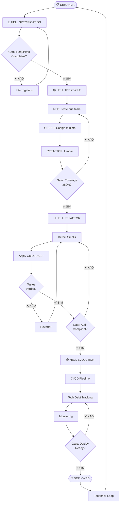

# 💀 HELL WORKFLOW STEPS v2.0
# Detalhamento das Fases: Especificação → Evolução

> *"Cada fase tem um gate. Nenhum gate é opcional."*

---

## VISÃO GERAL DO CICLO

```
┌────────────┐    ┌────────────┐    ┌────────────┐    ┌────────────┐
│    SPEC     │───►│    TDD     │───►│  REFACTOR  │───►│  EVOLVE    │
│ Specification│   │ Red/Green  │    │ GoF/GRASP  │    │ CI/CD+Debt │
└────────────┘    └────────────┘    └────────────┘    └────────────┘
     │                  │                  │                  │
  Gate: REQ          Gate: TEST        Gate: AUDIT       Gate: DEPLOY
  Compliance         Passing           Compliance        Readiness
```

---

## FASE 1: HELL SPECIFICATION 🔴

### Objetivo
Extração bruta de requisitos. Zero ambiguidade. Zero suposição.

### Entrada
- Briefing do usuário (texto livre, conversa, documento)
- Contexto do projeto existente (se houver)

### Processo

```
STEP 1.1 — INTERROGATÓRIO DE REQUISITOS
├── Funcional: O que o sistema FAZ?
│   ├── Atores primários
│   ├── Casos de uso (formato: Ator → Ação → Resultado)
│   └── Boundary conditions (edge cases)
│
├── Não-Funcional: Como o sistema SE COMPORTA?
│   ├── Performance (latência, throughput)
│   ├── Escalabilidade (horizontal? vertical?)
│   ├── Segurança (autenticação, autorização, OWASP top 10)
│   └── Disponibilidade (SLA target)
│
└── Constraints: O que o sistema NÃO PODE fazer?
    ├── Tech stack obrigatória
    ├── Limites de budget/infra
    └── Regulatório (LGPD, GDPR)

STEP 1.2 — MAPEAMENTO DE DOMÍNIO
├── Entidades identificadas
├── Value Objects identificados
├── Agregados e suas boundaries
├── Eventos de domínio
└── Ubiquitous Language (glossário)

STEP 1.3 — ANALYSIS PATTERNS
├── Information Expert → Quem detém cada dado?
├── Creator → Quem cria cada entidade?
├── Protected Variations → O que pode mudar?
└── Controller → Quem orquestra cada use case?
```

### Artefatos de Saída

```markdown
## hell-spec.md

### Requisitos Funcionais
| ID    | Caso de Uso              | Ator     | Prioridade | Status   |
|-------|--------------------------|----------|------------|----------|
| RF-01 | [Descrição]              | [Ator]   | MUST       | PENDING  |
| RF-02 | [Descrição]              | [Ator]   | SHOULD     | PENDING  |

### Requisitos Não-Funcionais
| ID     | Categoria    | Métrica         | Target      |
|--------|-------------|-----------------|-------------|
| RNF-01 | Performance | Latência p99    | <200ms      |
| RNF-02 | Segurança   | Auth method     | JWT + RBAC  |

### Domain Model
| Entidade       | Responsabilidade (Expert)    | Creator          |
|----------------|------------------------------|------------------|
| [Entity]       | [O que sabe/faz]             | [Quem cria]      |

### Pontos de Variação (Protected Variations)
| Ponto              | Abstração Protetora      | Interface           |
|--------------------|--------------------------|---------------------|
| [O que pode mudar] | [Como protegemos]        | [Nome da interface] |
```

### Gate de Saída
- [ ] Todos os requisitos têm prioridade (MUST/SHOULD/COULD/WONT)
- [ ] Domínio modelado com pelo menos: Entities, VOs, Aggregates
- [ ] Pontos de variação identificados com interfaces definidas
- [ ] Glossário (Ubiquitous Language) documentado
- [ ] **Aprovação do usuário** antes de prosseguir

---

## FASE 2: HELL TDD CYCLE 🟢

### Objetivo
Implementação dirigida por testes. Sem teste = Sem código.

### Ciclo Interno

```
┌─────────────────────────────────────────────────┐
│                                                   │
│   ┌───────┐                                       │
│   │  RED  │ Escreva o teste que FALHA              │
│   │       │ → Define O QUE o sistema deve fazer    │
│   │       │ → Teste DEVE compilar mas FALHAR       │
│   └───┬───┘                                       │
│       │                                           │
│       ↓                                           │
│   ┌───────┐                                       │
│   │ GREEN │ Escreva o código MÍNIMO que passa      │
│   │       │ → Sem otimização                       │
│   │       │ → Sem refactor                         │
│   │       │ → Apenas o suficiente para VERDE       │
│   └───┬───┘                                       │
│       │                                           │
│       ↓                                           │
│   ┌──────────┐                                    │
│   │ REFACTOR │ Limpe e otimize                     │
│   │          │ → Aplique GRASP/GoF                 │
│   │          │ → Testes CONTINUAM verdes            │
│   │          │ → Documente padrão aplicado          │
│   └──────────┘                                    │
│                                                   │
│   Repita para CADA unidade funcional               │
└─────────────────────────────────────────────────┘
```

### Processo Detalhado

```
STEP 2.1 — RED: Definição do Contrato
├── Identifique a MENOR unidade testável
├── Escreva o teste declarando:
│   ├── Given: Estado inicial (Arrange)
│   ├── When: Ação executada (Act)
│   └── Then: Resultado esperado (Assert)
├── Execute o teste → DEVE FALHAR
└── Commit: "test: RED — [nome_do_teste]"

STEP 2.2 — GREEN: Implementação Mínima
├── Escreva o código mínimo que faz o teste passar
├── REGRAS:
│   ├── PROIBIDO otimizar nesta fase
│   ├── PROIBIDO adicionar código não coberto por teste
│   └── PROIBIDO mudar teste existente para "passar"
├── Execute o teste → DEVE PASSAR
└── Commit: "feat: GREEN — [funcionalidade]"

STEP 2.3 — REFACTOR: Otimização Estrutural
├── Identifique code smells:
│   ├── Duplicação
│   ├── Método longo (>20 LOC)
│   ├── Classe grande (>200 LOC)
│   ├── Feature envy
│   ├── Shotgun surgery
│   └── Divergent change
├── Aplique padrão GRASP/GoF adequado
├── Execute TODOS os testes → DEVEM CONTINUAR VERDES
├── Documente: qual padrão, POR QUÊ
└── Commit: "refactor: [padrão] — [justificativa]"
```

### Artefatos de Saída

```markdown
## hell-tdd-log.md

### Ciclo TDD — [Feature]

| Fase     | Teste                    | Status | Padrão Aplicado | Commit Hash |
|----------|--------------------------|--------|-----------------|-------------|
| RED      | should_[comportamento]   | ✅ FAIL | —               | abc1234     |
| GREEN    | should_[comportamento]   | ✅ PASS | —               | def5678     |
| REFACTOR | should_[comportamento]   | ✅ PASS | Strategy        | ghi9012     |
```

### Gate de Saída
- [ ] Coverage ≥80% (linhas E branches)
- [ ] Zero testes pulados (skipped/ignored)
- [ ] Cada classe tem justificativa de padrão GRASP
- [ ] Commits seguem convenção: `test:`, `feat:`, `refactor:`
- [ ] Nenhum code smell crítico remanescente

---

## FASE 3: HELL REFACTOR — Otimização GoF 🔵

### Objetivo
Aplicação sistemática de Design Patterns para máxima extensibilidade.

### Processo

```
STEP 3.1 — SMELL DETECTION (Auditoria)
├── Execute análise estática (lint, metrics)
├── Identifique violações GRASP:
│   ├── Low Cohesion → classes fazendo "muita coisa"
│   ├── High Coupling → muitas dependências cruzadas
│   ├── God Class → classe onisciente
│   └── Feature Envy → método usando dados de outra classe
└── Priorize: Critical > Major > Minor

STEP 3.2 — PATTERN MATCHING
├── Para cada smell, identifique o GoF adequado:
│
│   Smell: Conditional Complexity
│   └─► Strategy Pattern ou State Pattern
│
│   Smell: Constructor Overload
│   └─► Builder Pattern
│
│   Smell: God Class
│   └─► Facade + Decomposição em submódulos
│
│   Smell: Tight Coupling
│   └─► Observer ou Mediator
│
│   Smell: Duplicated Creation Logic
│   └─► Factory Method ou Abstract Factory
│
└── Documente decisão no Decision Log

STEP 3.3 — SAFE REFACTOR (Testes como Rede de Segurança)
├── Refatore UM pattern por vez
├── Execute testes entre CADA refatoração
├── Se teste quebrar → REVERTA e reavalie
├── Commit granular: "refactor(GoF): [pattern] — [módulo]"
└── Atualize diagrama de classes
```

### Artefatos de Saída

```markdown
## hell-refactor-report.md

### Refatorações Aplicadas

| Smell Detectado      | Padrão Aplicado | Módulo Afetado | Testes Mantidos | Commit   |
|----------------------|-----------------|----------------|-----------------|----------|
| Conditional chains   | Strategy        | AuthService    | ✅ 24/24         | abc123   |
| God class            | Facade          | UserManager    | ✅ 18/18         | def456   |
| Duplicate creation   | Factory Method  | NotificationSvc| ✅ 12/12         | ghi789   |

### Métricas Antes/Depois

| Métrica              | Antes | Depois | Delta   |
|----------------------|-------|--------|---------|
| Cyclomatic Complexity| 42    | 18     | -57%    |
| Coupling (avg)       | 8.3   | 3.1    | -63%    |
| Cohesion (avg)       | 0.34  | 0.82   | +141%   |
| LOC (total)          | 4200  | 3800   | -9.5%   |
```

### Gate de Saída
- [ ] Nenhum smell crítico remanescente
- [ ] Acoplamento médio <5 dependências
- [ ] Coesão média >0.7 (LCOM4)
- [ ] Todos os testes passam
- [ ] Diagramas de classe atualizados
- [ ] Decision Log atualizado

---

## FASE 4: HELL EVOLUTION — CI/CD + Tech Debt 🟣

### Objetivo
Automação completa e rastreamento de dívida técnica.

### Processo

```
STEP 4.1 — CI/CD PIPELINE
├── Lint → Format → Test → Build → Deploy
├── Configuração:
│   ├── Pre-commit hooks (lint + format)
│   ├── CI pipeline (test + build)
│   ├── CD pipeline (deploy staging → production)
│   └── Quality gates (coverage, complexity thresholds)
└── Ação: Criar/atualizar pipeline config

STEP 4.2 — TECH DEBT TRACKING
├── Categorize dívida técnica:
│   ├── 🔴 CRITICAL: Segurança, data loss risk
│   ├── 🟡 MAJOR: Performance, maintainability
│   ├── 🟢 MINOR: Code style, naming conventions
│   └── ⚪ TRIVIAL: Comments, documentation gaps
├── Registre em: memory/hell-tech-debt.md
└── Priorize: Security > Performance > Maintainability > Style

STEP 4.3 — MONITORING & FEEDBACK LOOP
├── Application metrics (APM)
├── Error tracking
├── Performance budgets
├── User feedback integration
└── Alimentar próximo ciclo HELL Specification

STEP 4.4 — DOCUMENTATION SYNC
├── README atualizado
├── API docs (OpenAPI/Swagger se aplicável)
├── Architecture Decision Records (ADRs)
├── CHANGELOG.md atualizado
└── Obsidian notes sincronizadas
```

### Artefatos de Saída

```markdown
## hell-evolution-status.md

### Pipeline Status

| Stage      | Tool        | Status | Threshold        |
|------------|-------------|--------|------------------|
| Lint       | [tool]      | ✅ PASS | Zero warnings    |
| Format     | [tool]      | ✅ PASS | Auto-fixed       |
| Test       | [tool]      | ✅ PASS | Coverage ≥80%    |
| Build      | [tool]      | ✅ PASS | <30s             |
| Deploy     | [tool]      | ✅ PASS | Zero-downtime    |

### Tech Debt Backlog

| ID    | Severidade | Descrição              | Effort | Impacto | Sprint |
|-------|-----------|------------------------|--------|---------|--------|
| TD-01 | 🔴 CRIT   | [descrição]            | M      | HIGH    | Next   |
| TD-02 | 🟡 MAJOR  | [descrição]            | S      | MED     | +1     |
| TD-03 | 🟢 MINOR  | [descrição]            | XS     | LOW     | +2     |
```

### Gate de Saída
- [ ] CI pipeline verde
- [ ] Zero vulnerabilidades críticas
- [ ] Tech debt catalogada e priorizada
- [ ] Documentação 100% sincronizada
- [ ] Feedback loop ativo

---

## FLUXO COMPLETO — Visualização



---

## QUICK REFERENCE — Comandos HELL

```bash
# Dentro do Delegado OS
/delegado hell:spec       # Iniciar especificação
/delegado hell:tdd        # Iniciar ciclo TDD
/delegado hell:refactor   # Iniciar refatoração GoF
/delegado hell:evolve     # Iniciar evolução CI/CD
/delegado hell:audit      # Auditoria GRASP/GoF compliance
/delegado hell:debt       # Ver tech debt backlog
/delegado hell:status     # Status geral do ciclo
```

---

**HELL WORKFLOW STEPS — LOADED.**
**Todas as fases armadas. Gates ativos. Pronto para execução.**
