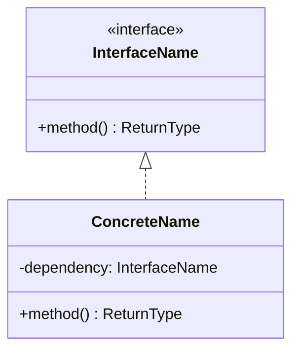
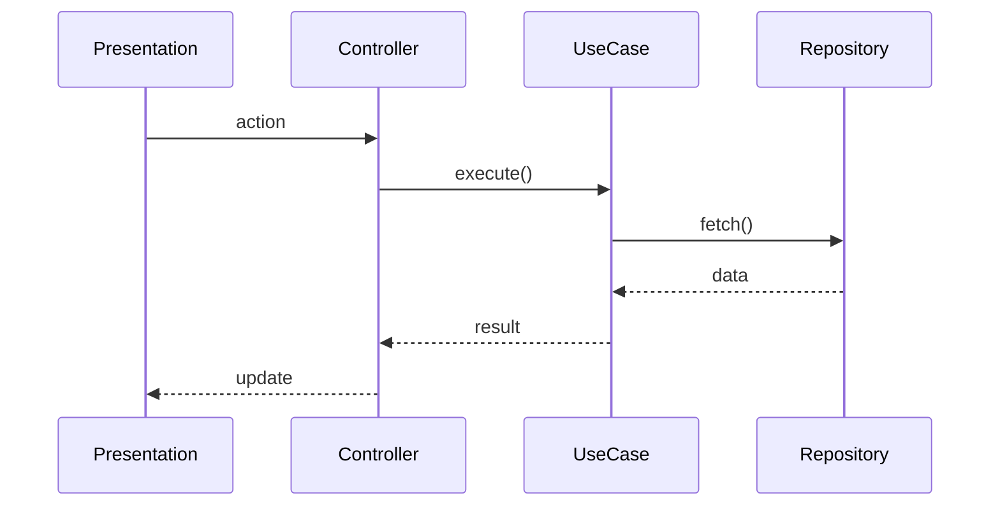

# 💀 HELL Refactor Report: {{MODULE}}

```yaml
Project: "[[{{PROJECT}}]]"
HELL_Phase: Refactor
HELL_Gate: PENDING
Status: 🔥 ACTIVE
Smells_Detected: 0
Patterns_Applied: 0
Tests_Maintained: true
```

---

## 1. Smell Detection

### Scan Results

| # | Smell | Localização | Severidade | Evidência |
|:--|:------|:-----------|:-----------|:----------|
| S1 | | `lib/...` | 🔴 CRITICAL | |
| S2 | | `lib/...` | 🟡 MAJOR | |
| S3 | | `lib/...` | 🟢 MINOR | |

### Smell Reference

| Smell | Sintoma | Pattern Recomendado |
|:------|:--------|:-------------------|
| God Class | Classe com >200 LOC, muitas responsabilidades | Facade + Decomposition |
| Feature Envy | Método usando dados de outra classe | Move Method (Expert) |
| Conditional Complexity | Switch/if chains (>3 branches) | Strategy / State |
| Shotgun Surgery | Mudança em 1 feature requer editar N classes | Decorator / Strategy |
| Inappropriate Intimacy | Classes acessando internals uma da outra | Mediator / Indirection |
| Duplicate Code | Blocos repetidos em módulos diferentes | Template Method / Extract |
| Long Method | Método >20 LOC | Extract Method |
| Long Parameter List | Método com >4 params | Builder / Parameter Object |
| Data Clumps | Mesmos grupos de dados passados juntos | Value Object |

---

## 2. Pattern Application

### Refactoring R1 — {{smell}} → {{pattern}}

**Smell:** {{description}}
**Location:** `{{file_path}}`
**Pattern:** {{GoF/GRASP pattern name}}
**Justificativa:** {{why this pattern and not another}}

**Before:**
```{{lang}}
// code before refactoring
```

**After:**
```{{lang}}
// code after refactoring
```

**Tests:** ✅ {{passed}}/{{total}} passing
**Commit:** `refactor(GoF): {{pattern}} — {{module}}`

---

### Refactoring R2 — {{smell}} → {{pattern}}

_(copiar estrutura acima para cada refatoração)_

---

## 3. Métricas Antes/Depois

| Métrica | Antes | Depois | Delta | Status |
|:--------|:------|:-------|:------|:-------|
| Cyclomatic Complexity | | | | |
| Coupling (avg) | | | | |
| Cohesion LCOM4 (avg) | | | | |
| LOC (total) | | | | |
| Classes | | | | |
| Methods (avg per class) | | | | |

---

## 4. Diagrama de Classes (Pós-Refactor)



---

## 5. Diagrama de Sequência (Fluxo Principal)



---

## 6. Decision Log

| ID | Decisão | Padrão | Alternativas Rejeitadas | Consequências |
|:---|:--------|:-------|:------------------------|:-------------|
| D1 | | | | ✅ / ⚠️ |
| D2 | | | | ✅ / ⚠️ |

---

## 7. Gate M-QUALITY — Checklist

- [ ] Nenhum smell CRITICAL remanescente
- [ ] Acoplamento médio <5 dependências
- [ ] Coesão média >0.7 (LCOM4)
- [ ] Todos os testes passam
- [ ] Diagramas de classe atualizados
- [ ] Diagramas de sequência atualizados
- [ ] Decision log preenchido

**Gate Status:** ⬜ PENDING | ✅ PASSED | ❌ BLOCKED

---

## 8. Próximo Passo

→ Gate M-QUALITY aprovado → Prosseguir para `/dos-hell:evolve`
